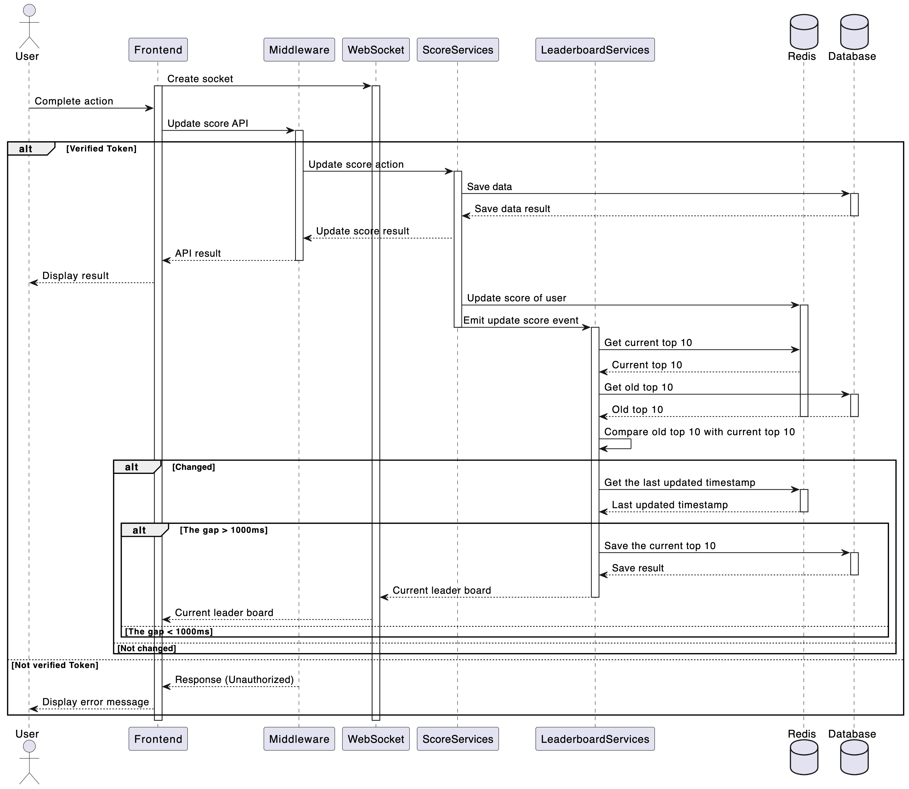

# Score board api services #

## Software Requirements
1. We have a website with a score board, which shows the top 10 user’s scores.
2. We want live update of the score board.
3. User can do an action (which we do not need to care what the action is), completing this action will increase the user’s score.
4. Upon completion the action will dispatch an API call to the application server to update the score.
5. We want to prevent malicious users from increasing scores without authorisation.
## Table of Contents
1. [API endpoints](#1-api-endpoints)
2. [Data Model](#2-data-model)
3. [Flow of Execution](#3-flow-of-execution)
4. [Improvements](#4-improvements)

## 1. API endpoints 
1. Update Score
- Endpoint: /api/update-score
- Method: POST
- Description: Updates the user's score upon completion of an action.
- Header
    - Authorzation: "Bearer 'JWT_TOKEN'"
- Request Body:
```
{
  "user_id": "string",
  "score":"number",
}
```
- Response:
```
{
  "status": "string",
  "new_score": "number",
  "message": "string"
}
```
2. Get Top Scores
- Endpoint: /api/top-scores
- Method: GET
- Description: Retrieves the top 10 user scores.
- Request Body:
- Response:
```
{
    "top_scores":[
        {
            "user_id": "string",
            "name":"string",
            "score":"number",
        }
    ]
}
```

## 2. Data Model
- ### Database
#### User
- user_id: String (Primary Key)
- name: String
- score: Integer
#### Action
- action_id: String (Primary Key)
- user_id: String (Foreign Key)
- score: Integer (if the score is vary based on action)
- timestamp: DateTime
- ### Redis database

#### User_score
- user_id: score

#### User_updated_timestamp
- user_id: timestamp

#### Top_scores_updated_timestamp
- last_updated: timestamp


## 3. Flow of Execution



### Description
- The user completes an action on the frontend.
- The frontend sends a POST request to the backend with the user's ID, action ID, and auth token.
- The middleware verifies the auth token
- If not, respond with error messages
- If verified, the ScoreServices updates the user's score in the database.
- Then respond to the frontend with the new score.
- The ScoreServices update the score of user in redis database
- The LeaderboardServices listen the above event, then get the current top 10 in redis to compare with the old top 10 in the database
- If the top 10 change
    - Retrieve the timestamp of the last updated, if current_timestamp - last_timestamp > 1000ms (or any other value as your wish) then save the current top 10 to the database 
    - For every user who is connecting to the LeaderboardServices through WebSocket, retrieve the timestamp of the last updated of the user, if current_timestamp - last_timestamp > 1000ms (or any other value as your wish), emit the event of refreshing the leaderboard to them

## 4. Improvements
- Rate Limiting: Implement rate limiting on the /api/update-score endpoint to prevent abuse.
- Monitoring and Logging: Implement monitoring and logging to detect and respond to suspicious activities promptly.
- Scalability: Consider using a distributed database and load balancers to handle high traffic and ensure the service remains responsive.
- Security: Use HTTPS to encrypt all data in transit and periodically rotate auth tokens for enhanced security.(using accessToken and refreshToken)